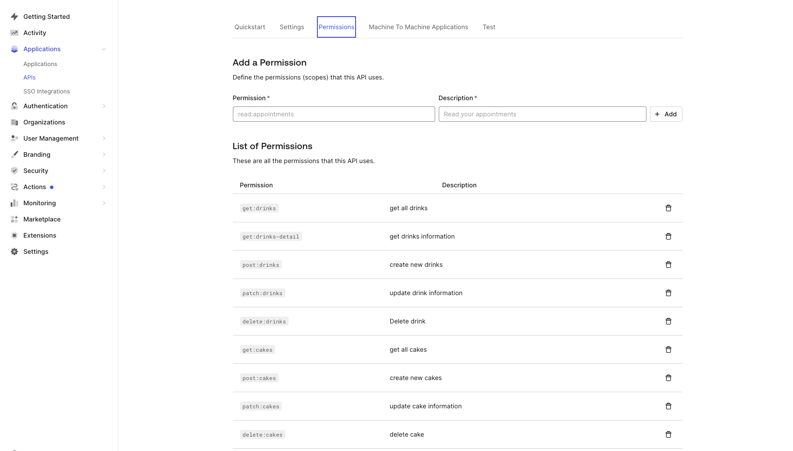
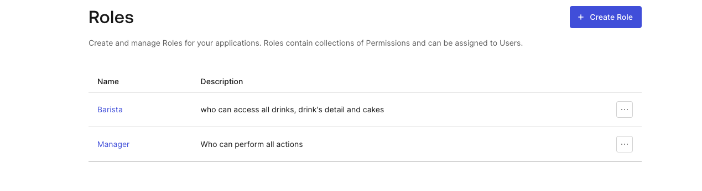
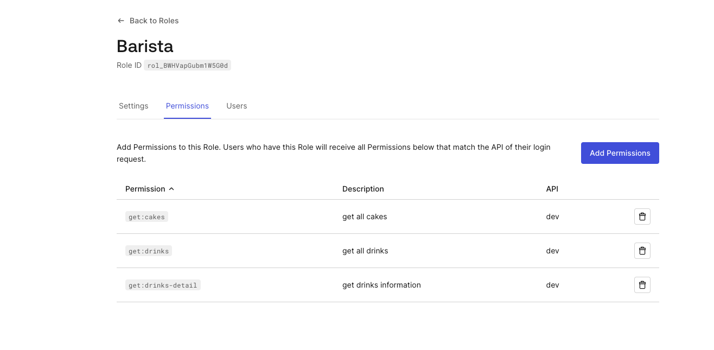
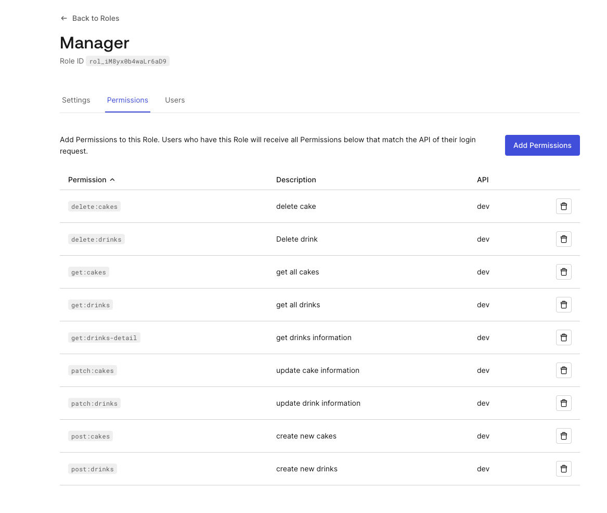

# Capstone Backend

## Getting Started

### Installing Dependencies

#### Python 3.9

Follow instructions to install the latest version of python for your platform in the [python docs](https://docs.python.org/3/using/unix.html#getting-and-installing-the-latest-version-of-python)

#### Virtual Environment

We recommend working within a virtual environment whenever using Python for projects. This keeps your dependencies for each project separate and organized. Instructions for setting up a virtual environment for your platform can be found in the [python docs](https://packaging.python.org/guides/installing-using-pip-and-virtual-environments/)

#### PIP Dependencies

Once you have your virtual environment setup and running, install dependencies by naviging to the `/backend` directory and running:

```bash
pip install -r requirements.txt
```

This will install all of the required packages we selected within the `requirements.txt` file.

##### Key Dependencies

- [Flask](http://flask.pocoo.org/) is a lightweight backend microservices framework. Flask is required to handle requests and responses.

- [SQLAlchemy](https://www.sqlalchemy.org/) and [Flask-SQLAlchemy](https://flask-sqlalchemy.palletsprojects.com/en/2.x/) are libraries to handle the lightweight sqlite database. Since we want you to focus on auth, we handle the heavy lift for you in `./src/database/models.py`. We recommend skimming this code first so you know how to interface with the Drink model.

- [jose](https://python-jose.readthedocs.io/en/latest/) JavaScript Object Signing and Encryption for JWTs. Useful for encoding, decoding, and verifying JWTS.

## Running the server

From within the `./backend` directory first ensure you are working using your created virtual environment.

Each time you open a new terminal session, run:

```bash
export FLASK_APP=api.py;
```

To run the server, execute:

```bash
flask run --reload
```

The `--reload` flag will detect file changes and restart the server automatically.

## Setup Auth0

### Create Auth0 Application


### Create Auth0 API and Permissions



### Create Auth0 Roles and Users







## Test Postman Collection

### Import Postman Collection

1. Open Postman
2. Click on Import
3. Click on Choose Files
4. Select the file `./backend/udacity-fsnd-udaspicelatte.postman_collection.json`

### Get JWT Tokens

Access the followin link to get the JWT tokens for the users:

```
https://dev-4ysrs5ruqzqqhcet.us.auth0.com/u/login?state=hKFo2SBSbHA4dUdPQnNBREZJcS1zZ2pEVlJwOWFaMzZpWjJWWKFur3VuaXZlcnNhbC1sb2dpbqN0aWTZIFJBVWhTWnpnSDRRZzdFdkRDU2ZoQTNFRkhmQmhORG5So2NpZNkgOE5mY1Vxb1ZQMGZVaW00VkZmWHA5cUJCQXdTb0owMlA
```

Then, inport Bearer Token into Postman.

### Test Endpoints

1. Click on the arrow next to the collection name to expand the collection
2. Choose folder `public`, `barista`, or `manager` and run tests on the endpoints

## User

### Barista

email: coffee_shop_barista@auth0.com
password: 123456A@

### Manager

email coffee_shop_manager@auth0.com
password: 123456A@
